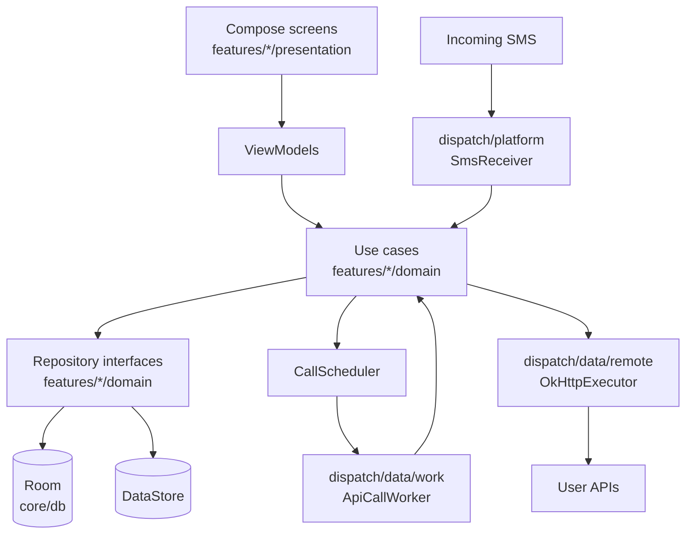
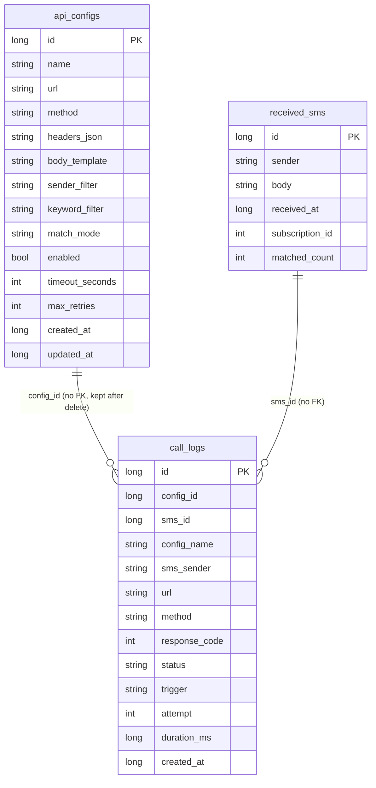

# SMS to API

| | |
|---|---|
| Overview | Android app that calls user-configured HTTP APIs whenever an incoming SMS matches a rule, built to run unattended in the background |
| Last edit | 2026-09-29 |
| Author | Dam Hong Duc |

## Store links

| Platform | Link |
|---|---|
| Google Play | Not published |

## App IDs

| Platform | Build type | ID type | Value |
|---|---|---|---|
| Android | release | applicationId | `com.receiver.sms` |
| Android | debug | applicationId | `com.receiver.sms.debug` |
| Android | - | namespace | `com.receiver.sms` |

## Tech stack

| Category | Technology | Version |
|---|---|---|
| Build | Gradle / Android Gradle Plugin (built-in Kotlin) | 9.8.0 / 9.4.1 |
| Language | Kotlin / KSP | 2.4.20 / 2.3.12 |
| SDK | compileSdk / targetSdk / minSdk | 37 / 37 / 26 |
| UI | Jetpack Compose BOM, Material 3 | 2026.09.00 |
| Navigation | Navigation Compose (type-safe routes) | 2.10.2 |
| Architecture | MVVM + clean architecture, AndroidX Lifecycle | 2.11.0 |
| DI | Hilt / androidx.hilt | 2.60.1 / 1.4.0 |
| Local DB | Room | 2.8.5 |
| Settings | DataStore Preferences | 1.2.1 |
| Background work | WorkManager | 2.12.0 |
| Networking | OkHttp | 5.5.0 |
| Serialization | kotlinx.serialization | 1.11.0 |
| Tests | JUnit 4 / MockK / Turbine / MockWebServer | 4.13.2 / 1.14.11 / 1.2.1 / 5.5.0 |

## Project architecture

## Local database

