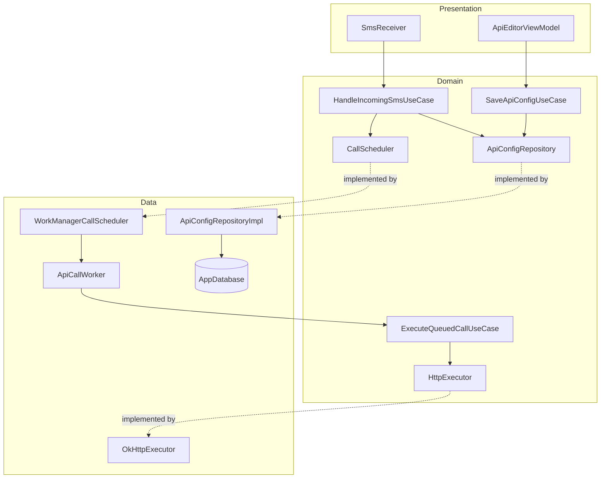
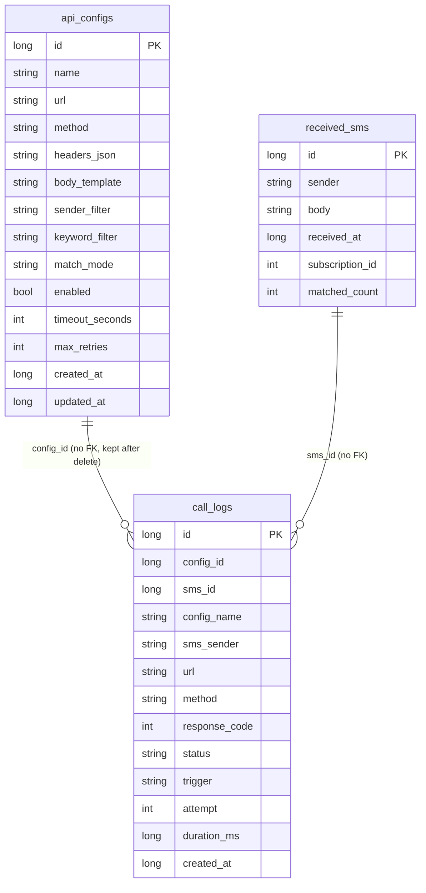

# SMS to API

| | |
|---|---|
| Overview | Android app that calls user-configured HTTP APIs whenever an incoming SMS matches a rule, built to run unattended in the background |
| Last edit | 2026-09-29 |
| Author | Dam Hong Duc |

## Store links

| Platform | Link |
|---|---|
| Google Play | Not published |

## App IDs

| ID | Value |
|---|---|
| Android applicationId | `com.receiver.sms` |
| Android namespace | `com.receiver.sms` |

## Tech stack

| Category | Technology | Version |
|---|---|---|
| Framework | Native Android, Jetpack Compose (BOM) + Material 3 | 2026.09.00 |
| Language | Kotlin | 2.4.20 |
| State management | ViewModel + StateFlow (AndroidX Lifecycle) | 2.11.0 |
| Backend | None (calls user-configured webhooks) | - |
| Local DB | Room | 2.8.5 |
| Notable libraries | WorkManager (durable, retrying API calls) | 2.12.0 |

## Project architecture

| | |
|---|---|
| Pattern | Clean Architecture + MVVM, feature-first |
| Encryption | No |

## Local database

